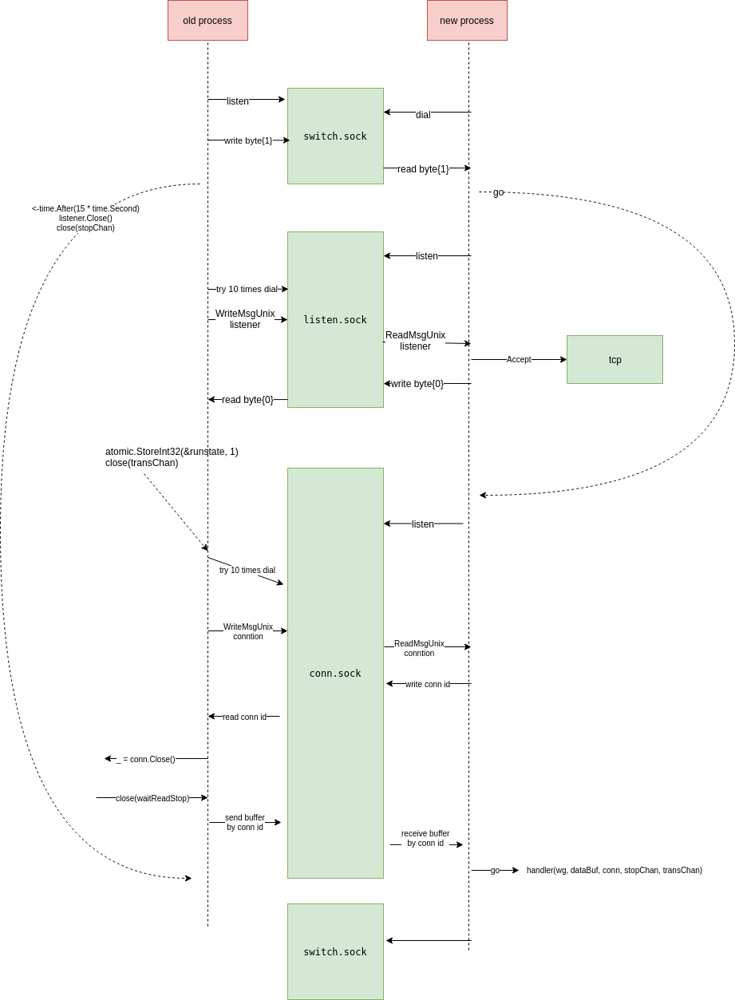

# restart

Go 服务端**零停机重启（Graceful Restart）**与**连接状态迁移**演示项目。

在不停机升级或滚动重启时，新进程可以接管旧进程的 TCP Listener 和已有客户端连接，并迁移尚未处理的读缓冲区数据，尽量做到对客户端无感知。

> 仅支持 Unix 类系统（Linux / macOS），依赖 Unix Domain Socket 与 `SCM_RIGHTS` 文件描述符传递。

## 背景

线上服务重启时，常见痛点包括：

- 监听端口短暂不可用，新连接被拒绝
- 已有 TCP 连接被强制断开，客户端需要重连
- 应用层读缓冲区中尚未处理的数据丢失

本项目演示一种进程间协作方案：旧进程在退出前，将 Listener、活跃连接 FD 以及读缓冲区内残留数据，通过 Unix Socket 传递给新进程。

## 架构概览

进程间通过三个 Unix Domain Socket 协作：

| Socket 文件 | 作用 |
|-------------|------|
| `switch.sock` | 新进程启动时探测是否存在旧进程；旧进程收到请求后触发迁移流程 |
| `listen.sock` | 旧进程将 TCP Listener 的 FD 传递给新进程 |
| `conn.sock` | 旧进程将每个活跃连接的 FD 及读缓冲区数据传递给新进程 |

### 迁移时序



**简要流程：**

1. **新进程启动** → 连接 `switch.sock`，确认需要继承
2. **新进程监听** `listen.sock` / `conn.sock`，等待旧进程传数据
3. **旧进程收到 switch 信号** → 将 Listener FD 写入 `listen.sock`
4. **新进程恢复 Listener** → 继续 `Accept` 新连接
5. **旧进程逐个迁移活跃连接** → 通过 `conn.sock` 传递连接 FD + 读缓冲数据
6. **新进程接管连接** → 从缓冲区继续处理，旧进程退出

## 快速开始

### 环境要求

- Go 1.16+（推荐 1.18+）
- Linux 或 macOS

### 安装依赖

```bash
go get golang.org/x/sys/unix
```

### 编译

```bash
go build -o restart .
```

### 启动服务

```bash
# -l 监听地址，-p 回复消息前缀
./restart -l :8081 -p hello
```

服务行为：客户端发送以 `#` 结尾的消息，服务端回复 `{prefix} reply : {message}`。

### 测试连接

```bash
# 使用 nc 或 telnet
nc localhost 8081
```

输入示例：

```
world#
```

服务端回复：

```
hello reply : world
```

### 演示零停机重启

**终端 1 — 启动旧进程：**

```bash
./restart -l :8081 -p hello
```

**终端 2 — 保持长连接：**

```bash
nc localhost 8081
# 输入 world# 后不要关闭
```

**终端 3 — 启动新进程（继承模式）：**

```bash
./restart -l :8081 -p hello
```

新进程会自动检测旧进程并完成 Listener / 连接迁移。继续在终端 2 发送消息，连接应保持可用。

**终端 1 — 触发旧进程退出：**

在旧进程所在终端按 `Ctrl+C`，或等待新进程完成迁移后旧进程自动退出。

## 命令行参数

| 参数 | 默认值 | 说明 |
|------|--------|------|
| `-l` | （必填场景下由继承决定） | TCP 监听地址，如 `:8081` |
| `-p` | （必填） | 回复消息前缀 |

首次启动时必须指定 `-p`；`-l` 在继承模式下由旧进程传递的 Listener 决定。

## 连接迁移协议

连接迁移通过 `conn.sock` 传输，消息类型由首字节标识：

| Type | 含义 |
|------|------|
| `0` | 传递连接 FD（`SCM_RIGHTS`） |
| `1` | 传递写缓冲区（**当前未实现**） |
| `2` | 传递读缓冲区数据 |

### 读缓冲迁移格式（Type 2）

```
 0                   4
+-----+-----+-----+-----+
|      data length      |
+-----+-----+-----+-----+
|    connection ID      |
+-----+-----+-----+-----+
|         data          |
+-----------------------+
```

1. 旧进程发送 Type `0`，附带 TCP 连接 FD
2. 新进程分配 `connection ID` 并回传
3. 旧进程关闭本地连接句柄，停止读取
4. 若读缓冲区有残留数据，旧进程以 Type `2` 发送 `conn ID + data`
5. 新进程用 `io.MultiReader` 拼接残留数据与连接，继续处理

## 项目结构

```
.
├── main.go           # 入口：信号处理、继承检测、协程编排
├── inherit.go        # Listener / 连接继承，switch.sock 监听
├── server.go         # TCP 服务与连接处理
├── transfer.go       # 连接迁移调度与 FD 解析
├── transfer_send.go  # 旧进程侧发送逻辑
├── transfer_recv.go  # 新进程侧接收逻辑
└── cm2.png           # 迁移时序图
```

## 核心实现要点

1. **FD 传递**：通过 `syscall.UnixRights` + `WriteMsgUnix` / `ReadMsgUnix` 在进程间传递 socket
2. **读缓冲不丢**：旧进程在 `transChan` 触发后，将 `bufio.Reader` 中未消费的数据一并迁移
3. **KeepAlive**：迁移前对连接设置 `SetKeepAlive(true)`，避免迁移窗口内连接被回收
4. **状态同步**：`runstate` 原子变量与 `transChan` 协调各协程的迁移与退出时机
5. **超时保护**：继承等待默认 15s，switch 监听退出前等待 5s，防止死锁

## 限制与说明

- **平台**：仅 Unix 系统；Windows 不支持 `SCM_RIGHTS`
- **写缓冲**：协议预留 Type `1`，当前未实现写缓冲区迁移
- **并发连接**：Demo 仅 `Accept` 一个连接用于演示，生产环境需循环 `Accept`
- **生产可用性**：本项目为学习/演示用途，未包含完整的错误恢复、监控、配置热加载等能力

## 类似方案

- [Nginx](https://nginx.org/en/docs/control.html) — `USR2` 信号 + `SO_REUSEPORT` 式热升级
- [grace](https://github.com/facebookarchive/grace) — Go HTTP 服务优雅重启
- [tableflip](https://github.com/cloudflare/tableflip) — 零停机升级库
- [go-graceful](https://github.com/tylerb/graceful) — HTTP 优雅关闭

## License

MIT（如需补充 License 文件可自行添加）
